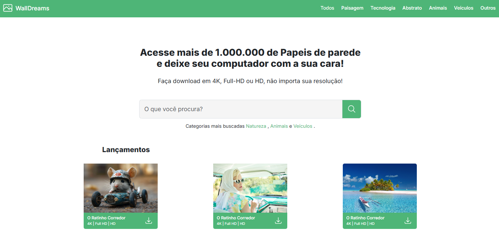

# 🖼️ WallDreams – Papéis de Parede em Alta Resolução

Projeto de uma interface web para download de papéis de parede em diversas categorias e resoluções, criado com foco em praticar desenvolvimento front-end moderno.

---

## 🔍 Descrição Geral

**WallDreams** é uma plataforma fictícia que oferece mais de 1 milhão de papéis de parede organizados por categorias como Natureza, Animais, Veículos, Paisagens, e muito mais. A interface permite ao usuário buscar, visualizar e baixar wallpapers em 4K, Full HD ou HD.

---

## 🎯 Objetivo

O objetivo principal é desenvolver uma interface atraente e funcional para um site de wallpapers, aplicando boas práticas de UI/UX, organização visual, responsividade e uso de frameworks modernos de estilo.

---

## 🖼️ Preview da Aplicação

### 📌 Página Inicial  
  
*Imagem de demonstração da interface principal com busca, categorias e lançamentos.*

---

## 🛠️ Tecnologias Utilizadas

- ⚙️ **HTML5** – Estrutura semântica e organizada do conteúdo  
- 🎨 **Sass** – Pré-processador CSS para melhor organização e reutilização de estilos  
- 🧰 **Bootstrap** – Framework para layout responsivo e componentes prontos  
- 📱 **Design Responsivo** – Adaptável para dispositivos móveis e desktops  

---

## 📚 Finalidade

> Projeto desenvolvido com finalidade educacional para aprimorar habilidades em HTML, Sass e Bootstrap.